# BIOHAZARD 5 SAVE EDITOR

Editor de save do **Resident Evil 5** para **Xbox 360** e **PC (Steam)** num
programa só, em português. Feito em Rust com interface em [Slint](https://slint.dev),
para Linux e Windows, sem HTML e sem depender de navegador ou WebView.

Substitui o editor anterior, que era só para Xbox 360: além dele, abre saves
de PC e edita os desbloqueios.

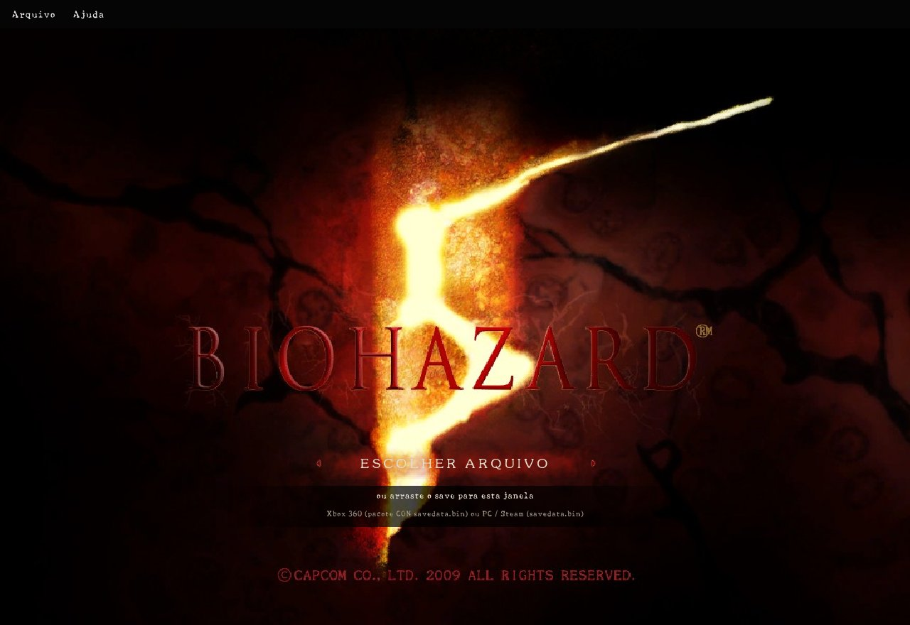

## Novidades da 2.1.0

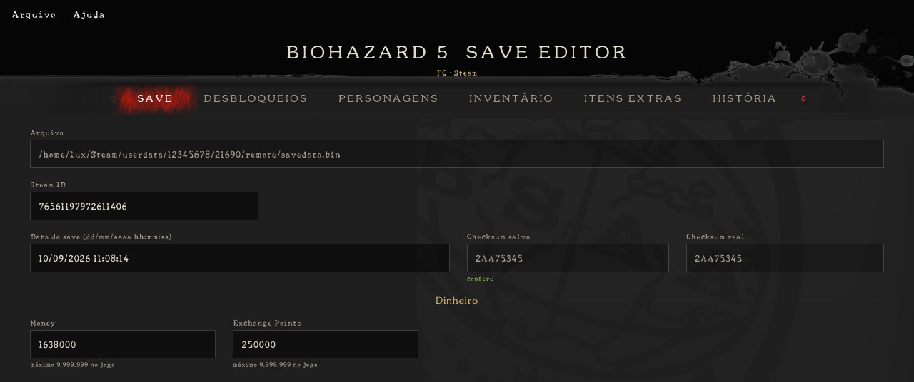

- **Inventário no save de PC (Steam).** As abas PERSONAGENS (os 9 slots do
  Chris e da Sheva) e INVENTÁRIO (o baú) agora funcionam também no save de
  PC, não só no do Xbox 360. Os endereços foram achados num save real da
  Steam e conferidos slot por slot contra a tela do jogo.
- **Conferido no jogo.** Num save real da Steam, o dinheiro e os pontos
  editados apareceram no RE5.
- **Abre direto na pasta da Steam**: `userdata/<conta>/21690/remote`, no
  Windows e no Linux (nativo, Flatpak e Snap).

## Novidades da 2.0.0

O editor ganhou a cara do jogo. Tudo o que aparece na tela veio dos arquivos
do próprio *BIOHAZARD 5*: texturas, layouts dos menus e a fonte.

- **Novo nome: BIOHAZARD 5 SAVE EDITOR.**
- **Tela inicial = tela de título do jogo**, remontada a partir do layout
  original (`top_play00`) e das texturas da ISO: o fundo rachado, o "5" em
  chamas e o logo BIOHAZARD.
- **Visual dos menus do jogo**: faixa rasgada no topo, abas com as setas e o
  brilho vermelho da seleção, listas como as da Biblioteca, paleta escura com
  texto cor de osso, vermelho e dourado.
- **Fonte do jogo embutida** (máquina de escrever e serifada), convertida da
  textura de letras do jogo. Igual em qualquer PC, sem depender das fontes do
  sistema. As letras que o jogo não tem (ã, õ e os acentos da serifada) foram
  montadas com as peças da própria fonte.
- **Personagens**: retratos originais do Chris e da Sheva em qualidade
  original, sobre os painéis *North America* e *West Africa* da tela de
  Organizar Itens.
- **Inventário com as peças do baú do jogo**: células, cursor de seleção e a
  moldura *ARCHIVE*.
- **Armas de inimigos ligadas aos inimigos**: 20 das 38 mostram a Figura do
  inimigo que as usa. 17 são confirmadas pelas próprias Figuras do jogo (o
  arquivo da Figura traz o modelo do inimigo e a arma que ele segura) e 3 têm
  forte evidência (os sons da arma estão dentro do arquivo do inimigo). As
  outras 18 continuam sem imagem: o jogo não mostra quem as usa.
- **Compilação endurecida**: nenhum `unsafe` no código do editor, checagem de
  estouro de inteiros no código do editor, RELRO completo no Linux e Control
  Flow Guard no Windows.
- **A gravação do save não mudou**: com os mesmos saves e as mesmas edições, o
  arquivo gravado é idêntico byte a byte ao da 1.2.0 (ver "Como foi conferido").

| | |
|---|---|
| 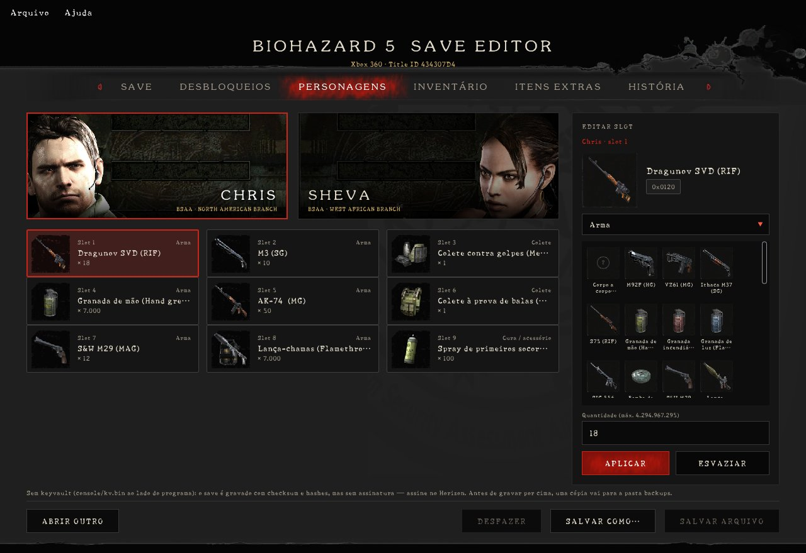 | 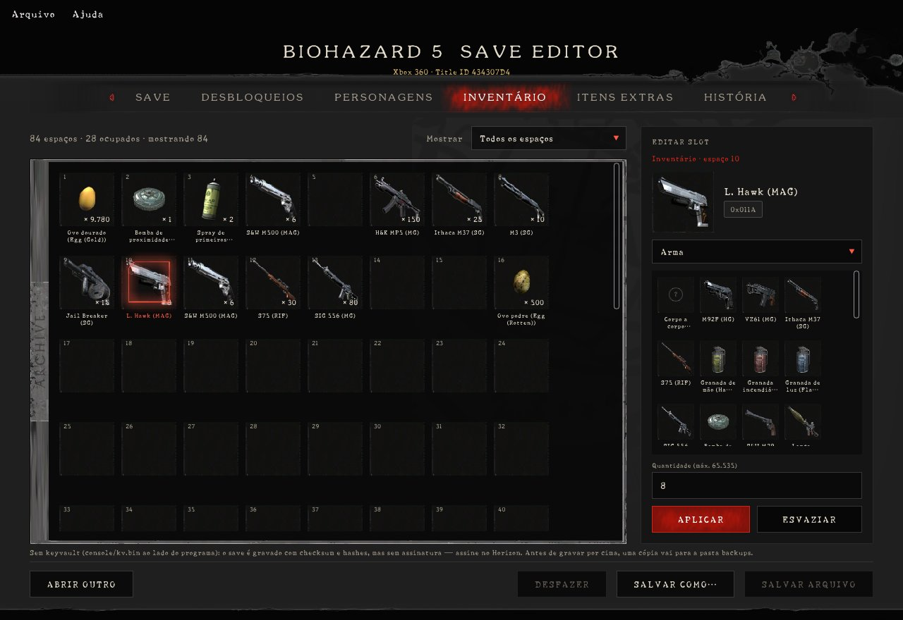 |
| 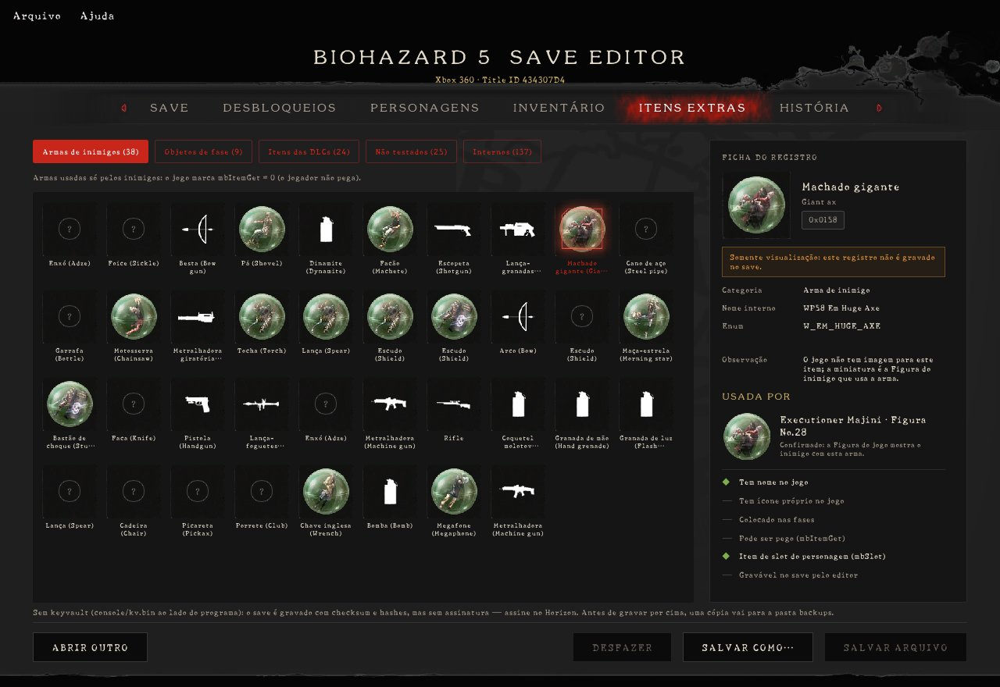 | 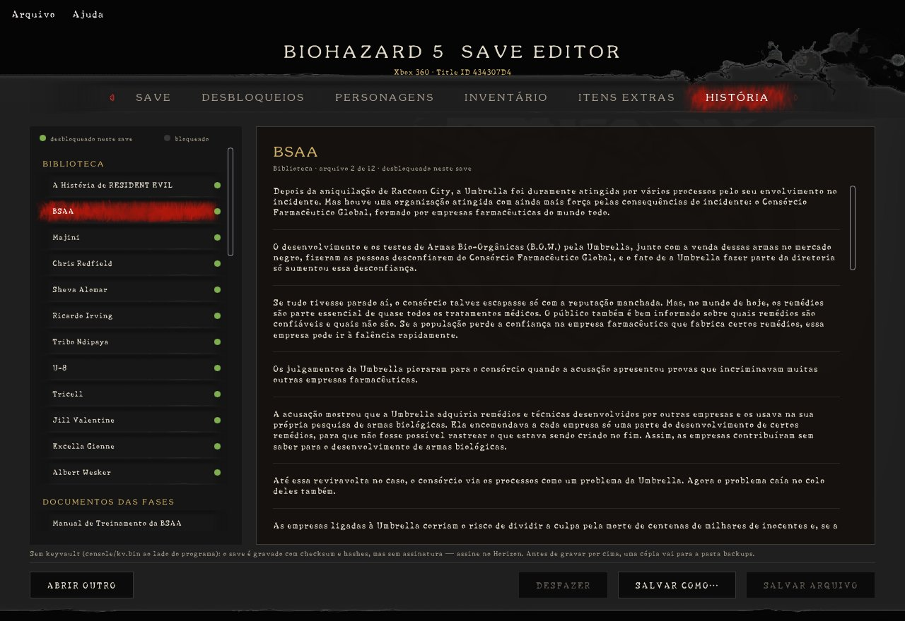 |

## Novidades da 1.2.0

- **Ícones originais do jogo** em todo o editor: slots do Chris e da Sheva,
  inventário (agora uma grade de ícones, como o baú do jogo) e escolha do item
  pelo ícone. São 174 ícones, tirados das texturas do próprio RE5 e das DLCs.
- **Ficha do item** no painel de edição: nome oficial, ID, descrição do jogo e
  marca de DLC.
- **Aba Itens Extras**: os registros da tabela de itens do jogo que não vão
  para o save (armas de inimigos, objetos de fase, armas sem nome das DLCs,
  coletáveis ainda não testados e registros internos), com ficha de cada um.
  Só para consulta.
- **Aba História**: os 12 arquivos da Biblioteca, os 26 documentos das fases e
  os 9 documentos das DLCs, **traduzidos para o português**, com leitor.
  Mostra quais arquivos estão desbloqueados no save aberto.
- **Nomes e descrições em português**, com o nome oficial em inglês entre
  parênteses (tradução própria do projeto).
- Itens das DLCs (Lost in Nightmares e Desperate Escape) ficam só em Itens
  Extras: só existem com a DLC carregada e não têm uso na campanha.
- **Catálogo dos 407 registros** de item (`dados/re5_itens_db.json`), montado
  a partir da tabela interna do jogo (ITEM_INFO_STRUCT) e dos textos do jogo e
  das DLCs. Os itens das DLCs Lost in Nightmares e Desperate Escape aparecem
  marcados.
- Nos slots do Chris e da Sheva, a lista oferece só o que o jogo aceita no
  slot do personagem (armas, munição, cura e coletes). O inventário continua
  com tudo. Um item que já esteja no save nunca some da lista.
- Nada novo passou a ser gravado: os itens graváveis são os mesmos da versão
  anterior (testados no console).

## Novidades da 1.1

- **Saves de PC (Steam)**, além do Xbox 360. Ao abrir, o editor descobre sozinho
  de qual plataforma é o save.
- **Desbloqueios no Xbox 360**: roupas do Chris e da Sheva, filtros de tela,
  munição infinita (19 armas), Arquivos da Biblioteca (12) e Figuras (45).
  No Xbox eles ficam 0xB4 bytes antes dos do PC (dinheiro em 0xE0 no Xbox e
  0x194 no PC). Conferido num save real: 0x7C tem exatamente 19 bits ligados
  (as 19 armas) e 0x80 tem 12 (os 12 arquivos). Só os bits de cada lista são
  alterados; bits desconhecidos ficam como estavam.
- **Data do save** editável, nas duas plataformas.
- **Interface nativa em Slint**: abas (Save, Desbloqueios, Personagens,
  Inventário), menus, tabela do inventário, seleção do Chris ou da Sheva pelo
  retrato e painel de edição do slot. Não usa HTML, CSS, JavaScript nem WebView:
  no Windows não precisa do WebView2.
- **Arrastar e soltar** o save na janela, e **Salvar como…**.
- No estilo do editor de PC do shinneider: wallpaper, cartão translúcido,
  campos e botões no estilo Material.

Continua tudo do editor do Xbox: Gold e Exchange Points, os 9 slots do Chris e
da Sheva, os 84 espaços do inventário (com os tesouros pelo nome), perfil
(XUID) e device ID copiados de outro save, assinatura automática com o keyvault
do console e backup antes de cada gravação.

## Telas da 1.2.0 (visual antigo)

As telas da 2.0.0 estão no começo deste README. Estas são as da versão 1.2.0,
com um save real do Xbox 360. Na primeira, o perfil
(XUID), o device ID, o console da assinatura e o caminho do arquivo foram
borrados.

### Save
Dinheiro, data do save, checksum, assinatura e os IDs de perfil e console.

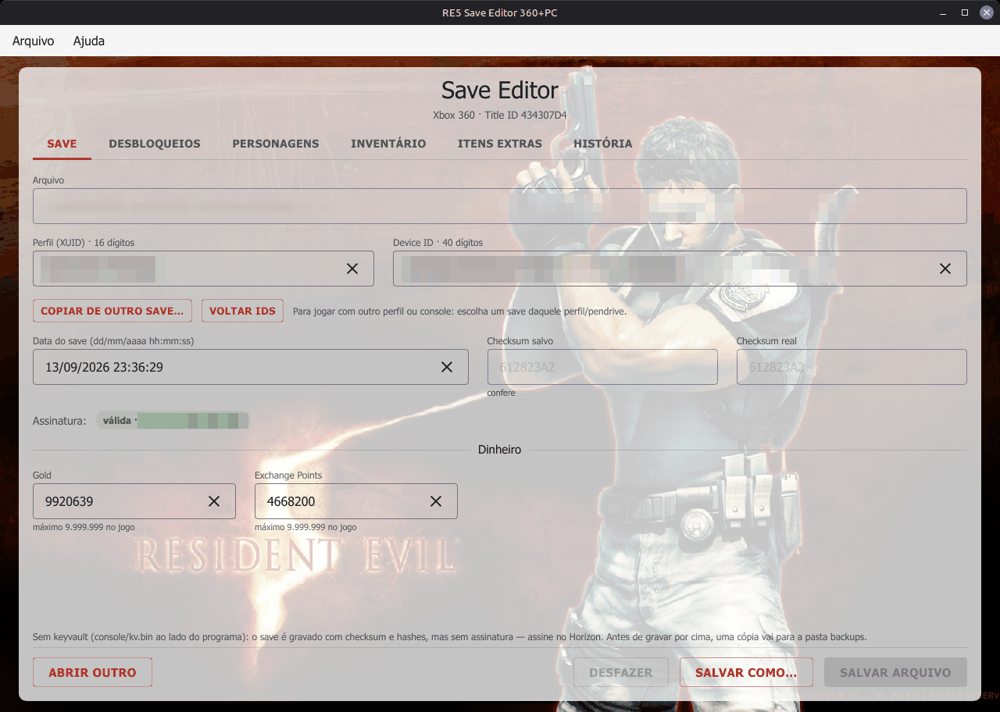

### Chris e Sheva
Os 9 slots de cada personagem com os ícones originais do jogo. Ao escolher um
slot, o painel mostra a ficha do item e a grade para trocar pelo ícone.

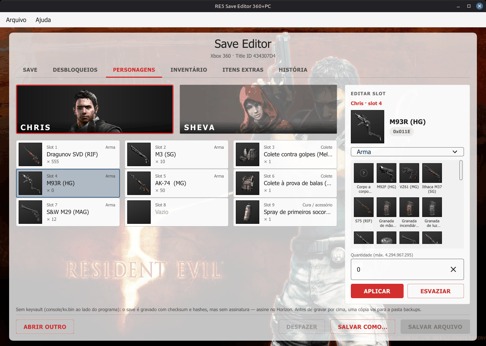

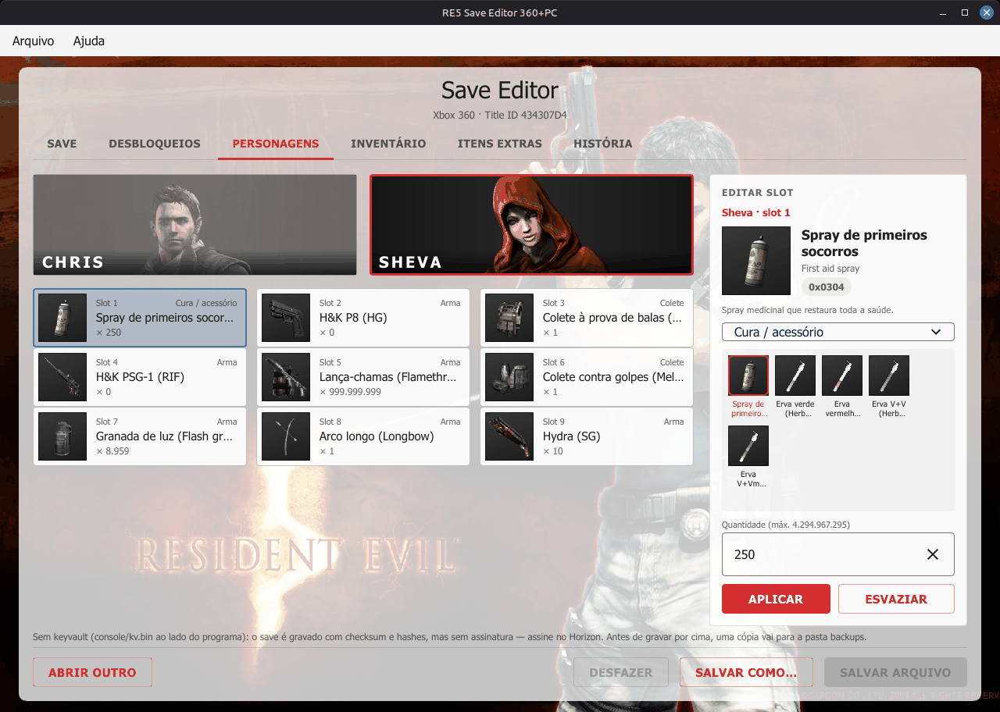

### Inventário
Os 84 espaços numa grade de ícones, como o baú do jogo, com quantidade e nome.
No painel, a grade de itens da classe escolhida (aqui, os tesouros).

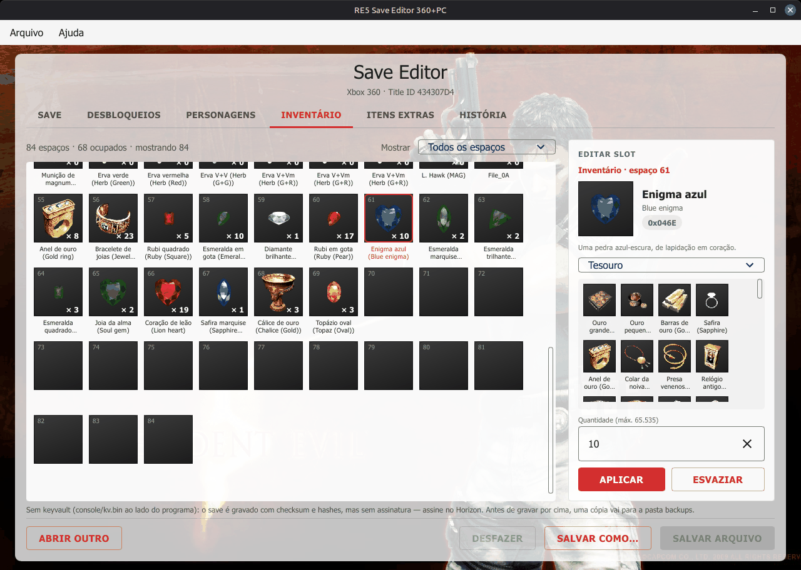

### Itens Extras
Registros da tabela de itens do jogo que não vão para o save, só para
consulta: itens das DLCs, armas de inimigos, objetos de fase e outros. Os
itens sem imagem no jogo aparecem com "?" (na 2.0.0, as armas de inimigos
mostram a Figura do inimigo que as usa).

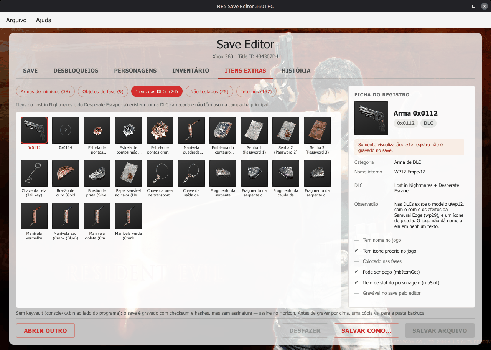

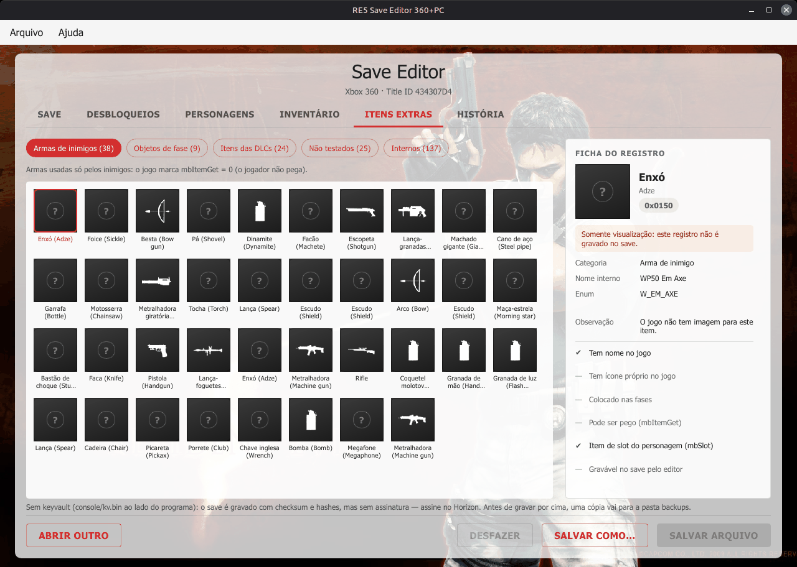

### Desbloqueios
Roupas do Chris e da Sheva, filtros de tela, munição infinita, arquivos da
Biblioteca e figuras.

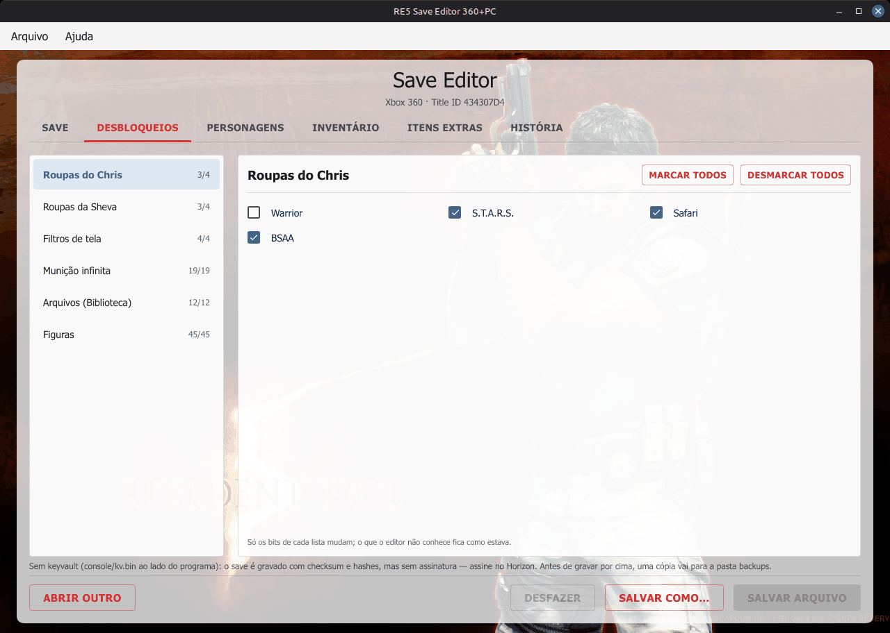

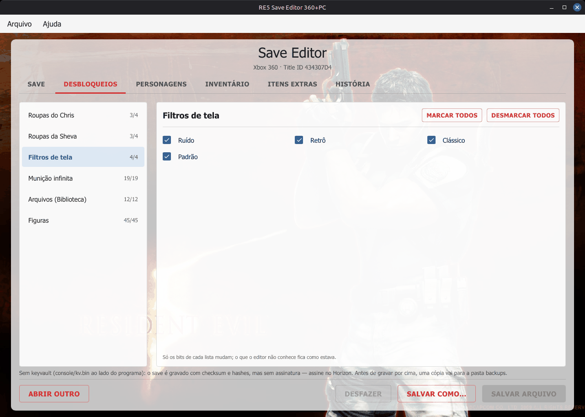

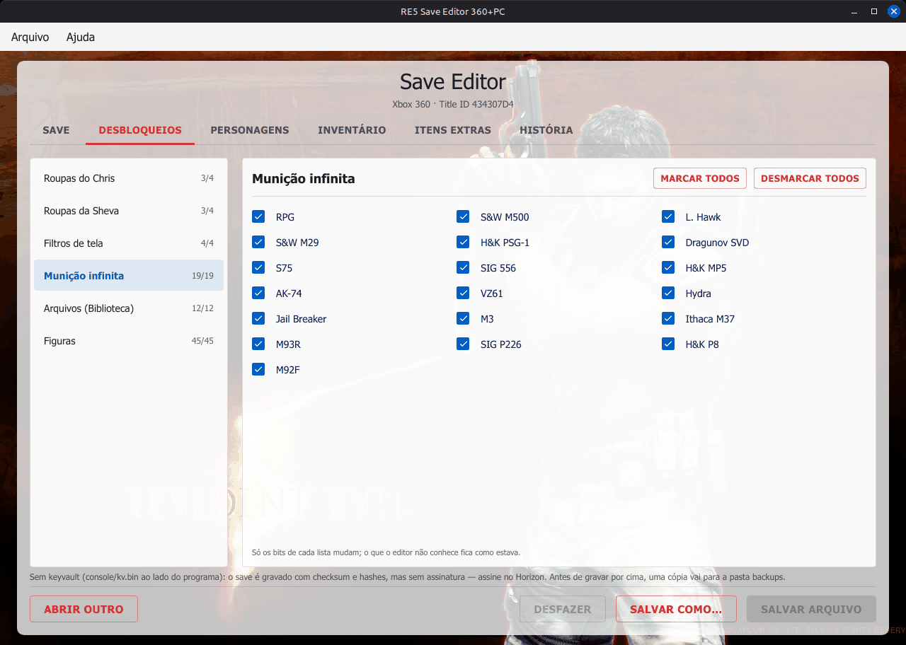

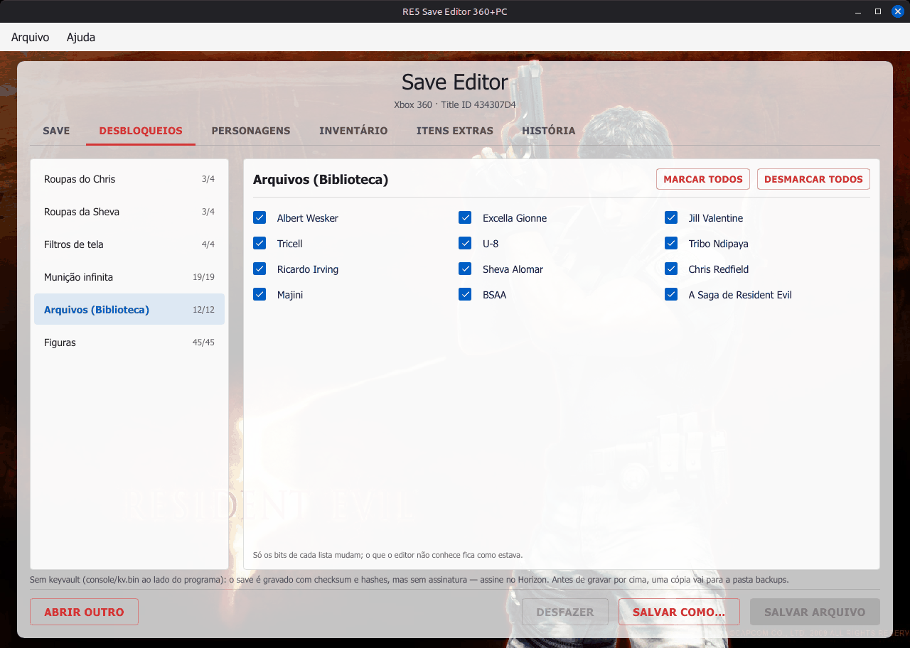

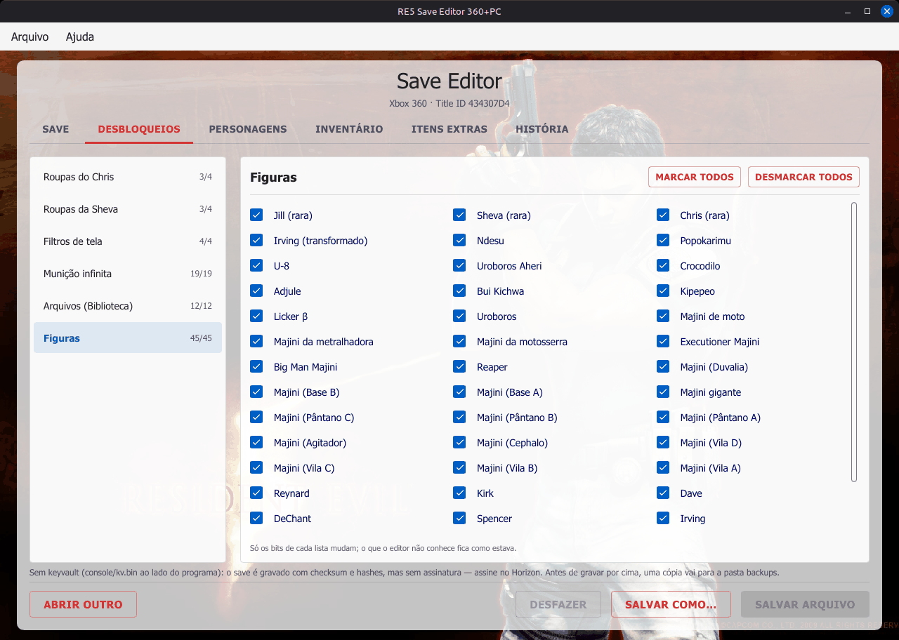

### História
Os arquivos da Biblioteca e os documentos do jogo e das DLCs, em português,
com a marca de desbloqueado no save aberto.

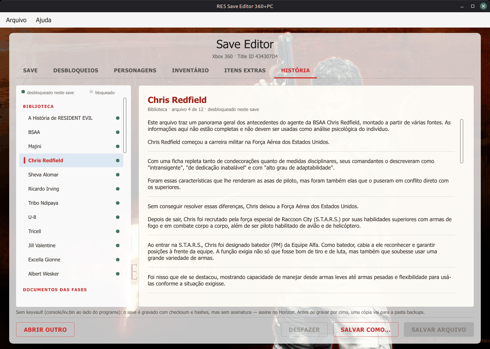

## O que edita

| | Xbox 360 | PC |
|---|:---:|:---:|
| Gold / Money e Exchange Points | ✓ | ✓ |
| Data do save | ✓ | ✓ |
| Roupas, filtros, munição infinita, arquivos, figuras | ✓ | ✓ |
| Slots do Chris e da Sheva, inventário (baú) | ✓ (84 espaços) | ✓ (74 espaços) |
| Perfil (XUID) e device ID | ✓ | — |
| Steam ID | — | ✓ |
| Assinatura com o keyvault do console | ✓ | — |

## Usar

Baixe na página de **Releases** e descompacte:

```
biohazard5-save-editor           Linux (~15 MB)
BIOHAZARD 5 SAVE EDITOR.exe      Windows 10/11
extrair-kv / extrair-kv.exe      tira o kv.bin da cópia da NAND (Linux / Windows)
console/kv.bin                   keyvault do seu console (opcional, para assinar)
backups/                         cópia do save antes de cada gravação
```

Abra o programa, clique em **Escolher arquivo** (ou arraste o save para a
janela), edite e clique em **Salvar arquivo**.

- Xbox 360: o `savedata.bin` do pendrive, em `Content\<perfil>\434307D4\00000001\`.
- PC: `Steam\userdata\<id>\21690\remote\savedata.bin` (no Linux,
  `~/.steam/steam/userdata/<id>/21690/remote/`). O diálogo já abre nessa pasta
  quando a Steam está instalada.

Sem o `kv.bin` o save do Xbox é gravado com checksum e hashes corretos, mas
sem assinatura. O `kv.bin` é a identidade do seu console: **não compartilhe**.
Como tirar o `kv.bin` do seu console, do começo ao fim: [docs/EXTRAIR-KV.md](docs/EXTRAIR-KV.md).

## Compilar

```bash
cargo build --release                                            # Linux
cargo xwin build --release --target x86_64-pc-windows-msvc       # Windows
cargo test --release
```

O `extrair-kv` (o programa que tira o kv.bin) é um pacote à parte, no mesmo
repositório, e compila sem a interface:

```bash
cargo build --release -p extrair-kv                                      # Linux
cargo xwin build --release -p extrair-kv --target x86_64-pc-windows-msvc # Windows
cargo test --release -p extrair-kv
```

Os executáveis saem em `target/release/extrair-kv` e
`target/x86_64-pc-windows-msvc/release/extrair-kv.exe`, para irem junto com o
editor na release.

No Linux precisa de `libgtk-3-dev` (diálogos de arquivo), `libfontconfig1-dev` e
`libxkbcommon-dev` (teclado da janela):

```bash
sudo apt install libgtk-3-dev libfontconfig1-dev libxkbcommon-dev
```

Para o `.exe` do Windows, a partir do Linux:

```bash
sudo apt install clang lld llvm
rustup target add x86_64-pc-windows-msvc
cargo install --locked cargo-xwin
```

`examples/verifica.rs` lê e edita saves pela linha de comando, para testes.

## Versão GOLD: a chave do seu console embutida

Para o save do Xbox 360 sair **assinado e pronto para o console**, o editor
precisa do keyvault (`kv.bin`) do **seu** Xbox. Na versão normal basta pôr o
`kv.bin` na pasta `console` ao lado do programa. Na versão GOLD ele vai
embutido no executável, e o programa assina sozinho, sem pasta nenhuma.

O `kv.bin` é a identidade do seu console. **Nunca compartilhe o `kv.bin`, a
CPU key, o dump da NAND nem um executável GOLD**, e nunca os envie para o
GitHub ou para a internet. Este repositório não tem chave nenhuma.

### 1. Tirar o seu kv.bin

Você precisa de dois arquivos do seu próprio console, que um Xbox 360 RGH/JTAG
fornece. O Simple 360 NAND Flasher e o J-Runner geram os dois ao ler a NAND:

- `flashdmp.bin` (ou `nanddump.bin`): a cópia da NAND;
- `cpukey.txt`: a CPU key do console, em hexadecimal.

```bash
cargo run --release -p extrair-kv                                                   # menu: acha as cópias sozinho
cargo run --release -p extrair-kv -- ~/Downloads/backup-nand.zip -o ~/kv-temp/kv.bin  # direto do zip
cargo run --release -p extrair-kv -- flashdmp.bin cpukey.txt -o ~/kv-temp/kv.bin      # arquivos soltos
```

Quem baixou a release usa o `extrair-kv` que vem nela, com os mesmos
argumentos (`./extrair-kv backup-nand.zip -o ~/kv-temp/kv.bin`). O script em
Python faz o mesmo: `python3 ferramentas/extrair-kv.py`.

Funciona com a cópia de qualquer placa: NAND de 16, 64, 256 ou 512 MB, com ou
sem ECC (Trinity, Corona 16 MB, Jasper e anteriores), e eMMC de 4 GB
(Corona 4 GB, Winchester). Antes de gravar, o programa confere o keyvault do
mesmo jeito que o console: o HMAC-SHA1 da CPU key tem que bater. Ele nunca
mostra a CPU key, nunca grava por cima de um arquivo e avisa se a cópia da
NAND veio com defeito.

O passo a passo do começo ao fim está em [docs/EXTRAIR-KV.md](docs/EXTRAIR-KV.md):
como fazer a cópia da NAND no console com o Simple 360 NAND Flasher, tirar o
`kv.bin` no PC e pôr a chave no editor, além das mensagens de erro e de como
guardar tudo com segurança. Depois de gerar o `kv.bin`, guarde as cópias num
lugar seguro e apague as que não precisar.

### 2. Compilar com a chave embutida

```bash
RE5_KV_EMBUTIDO=~/kv-temp/kv.bin cargo build --release --features kv-embutido --target-dir target-pessoal
```

O programa sai em `target-pessoal/release/biohazard5-save-editor`, com o
título **BIOHAZARD 5 SAVE EDITOR GOLD**.

Para a GOLD no Windows, o mesmo com o `cargo xwin` (precisa do que está em
"Compilar" para o `.exe`):

```bash
RE5_KV_EMBUTIDO=~/kv-temp/kv.bin cargo xwin build --release --target x86_64-pc-windows-msvc --features kv-embutido --target-dir target-pessoal
```

O `.exe` sai em `target-pessoal/x86_64-pc-windows-msvc/release/biohazard5-save-editor.exe`. Ao abrir um save do Xbox, a nota no
rodapé diz "Assinatura automática ativada com a chave embutida no programa
(console …)".

A compilação guarda uma cópia do `kv.bin` dentro de `target-pessoal`. Depois
de copiar o programa para onde vai usar, apague essa pasta e a cópia solta do
`kv.bin` (`rm -rf target-pessoal ~/kv-temp`). O `.gitignore` já deixa
`target-*`, `console/` e `*.bin` fora do repositório.

## Estrutura

```
src/save.rs          backend: lê e grava o save (Xbox 360 e PC)
src/sistema/         pastas, keyvault e diálogos de arquivo
src/interface/       controlador: o único ponto entre a interface e o backend
src/itens.rs         catálogo dos 407 registros de item (src/dados/itens.json)
src/historia.rs      textos da Biblioteca e documentos (src/dados/historia.json)
dados/               banco completo dos 407 registros (re5_itens_db.json)
ui/ponte.slint       tudo que a interface lê e os callbacks que ela chama
ui/app.slint         janela, menus e abas
ui/telas/            início, save, desbloqueios, personagens, inventário,
                     itens extras, história
ui/componentes/      botões, campos, listas, slots, ícones, diálogos
ui/imagens/icones.png  os 174 ícones originais num atlas
ui/imagens/jogo/     peças dos menus do jogo (título, faixas, seleção, baú)
ui/imagens/retratos/ retratos originais do Chris e da Sheva
ui/imagens/figuras.png miniaturas das 46 Figuras do jogo
ui/fontes/           fontes do jogo (BH5 Maquina e BH5 Serifa)
src/dados/inimigos.json  que inimigo usa cada arma de inimigo, com a prova
ferramentas/fonte/   gera as fontes .ttf a partir da textura de letras
ferramentas/extrair-kv/   o extrair-kv, em Rust: tira o kv.bin da cópia da NAND (ver docs/EXTRAIR-KV.md)
ferramentas/extrair-kv.py o mesmo, em Python
```

Detalhes da migração e o checklist das funções em [docs/MIGRACAO-SLINT.md](docs/MIGRACAO-SLINT.md).

## Como foi conferido

- **2.0.0**: o código que lê e grava o save é o mesmo da 1.2.0. Os 24 saves de
  Xbox 360 guardados foram gravados pelas duas versões com três conjuntos de
  edições (nenhuma, edições normais e valores extremos): 72 de 72 arquivos
  idênticos byte a byte.

- **Xbox 360**: sem mudanças, e com as mesmas edições, o arquivo gerado é
  idêntico byte a byte ao do editor anterior (só Xbox 360), que já foi testado
  no console.
  Nos desbloqueios mudam só os bytes esperados, e checksum, hashes e assinatura
  são validados pelo código antigo.
- **PC**: conferido contra o código original do shinneider. O editor lê os
  mesmos valores, e o arquivo gravado por ele passa no checksum do original.
  Conferido também num save real da Steam (de 2021): abre com o checksum
  certo, gravar sem mudanças devolve o arquivo idêntico byte a byte, e numa
  edição (dinheiro, pontos, roupas e filtros) mudam só esses campos e o
  checksum. O jogo mostrou o dinheiro e os pontos editados. O inventário do
  Chris, da Sheva e o baú foram localizados no mesmo save e conferidos slot
  por slot contra a tela do jogo (0x6F0 depois dos endereços do Xbox para os
  personagens, 0x6F4 para o baú).

## Créditos

| Parte | Autoria |
|---|---|
| Editor (código em Rust, interface em Slint) | lux-insider |
| Save do Xbox 360: leitura, gravação, checksum, hashes e assinatura com o keyvault | lux-insider |
| Slots do Chris e da Sheva e inventário, no Xbox 360 e no PC (PC desde a 2.1.0) | lux-insider |
| Ícones originais, Itens Extras e História em português (1.2.0) | lux-insider |
| Visual do próprio jogo, extraído da ISO (2.0) | lux-insider |
| Formato e endereços do save de PC e listas dos desbloqueios do PC | [RE5 Save Editor, de shinneider](https://github.com/shinneider/RE5-Save-Editor) (MIT) |
| Estilo da tela e wallpaper (só até a 1.2.0) | [RE5 Save Editor, de shinneider](https://github.com/shinneider/RE5-Save-Editor) (MIT) |

Detalhes, e o aviso de licença do projeto original, em [CREDITOS.txt](CREDITOS.txt).

*Resident Evil 5* / *BIOHAZARD 5* © CAPCOM CO., LTD. As imagens, texturas,
fontes, ícones e textos do jogo pertencem à Capcom.

**Projeto de fã, gratuito e sem fins lucrativos**, sem ligação com a Capcom ou a
Microsoft. Faça backup do save antes de editar; use por sua conta e risco.

## Licença

MIT — veja [LICENSE](LICENSE).

A interface usa o [Slint](https://slint.dev) sob a Slint Royalty-free License
(o "Sobre" do programa mostra o selo *Made with Slint*, como a licença pede).

[](https://slint.dev)
